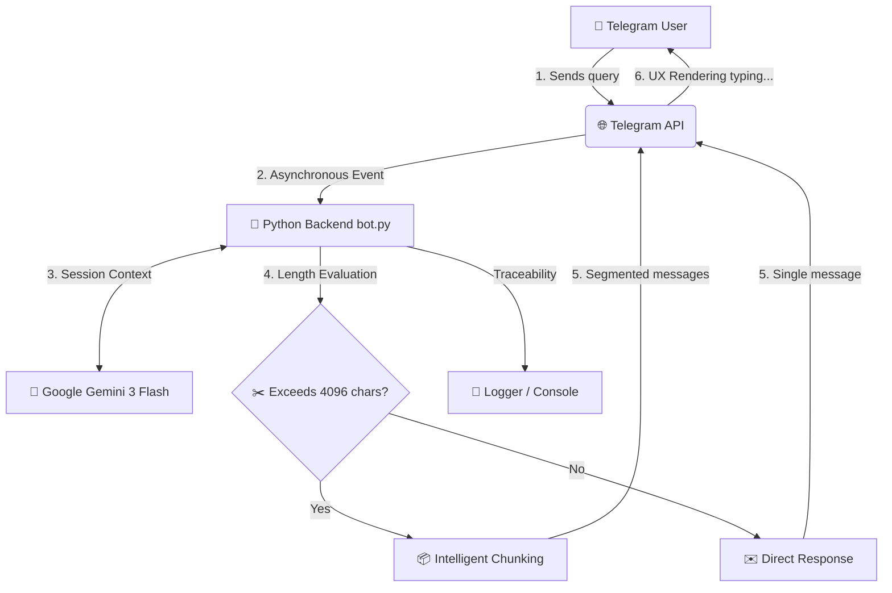

# 🤖 Telegram AI Bot with Gemini 3 Flash

An intelligent Telegram bot developed in Python that leverages the Google Gemini API to respond to queries in real time. It features native support for long responses through automatic message chunking.

## 📊 System Architecture & Message Flow

The bot operates under an asynchronous, event-driven architecture, managing the message lifecycle as follows:

Next-Gen AI: Native integration with Gemini 3 Flash.  Context Memory: Utilizes model.start_chat to maintain conversation history within a single session.  Asynchronous Processing: Built on python-telegram-bot to seamlessly handle multiple concurrent users without blocking.  Optimized UX: Implements real-time chat actions (typing...) while the AI generates responses.  Intelligent Chunking: Automatic segmentation system for responses exceeding Telegram's 4096-character limit.  Production-Grade Security: Credential management using environment variables (python-dotenv) and strict exclusion of sensitive files via Git.  
    
🛠️ Installation & SetupFollow these steps to get your own bot up and running: 

1. Clone the Repository
Bashgit clone [https://github.com/ronaldfmorac/bot-telegram-gemini.git](https://github.com/ronaldfmorac/bot-telegram-gemini.git)
cd bot-telegram-gemini

2. Create a Virtual EnvironmentBashpython -m venv venv
Activate on Windows:Bash.\venv\Scripts\activate
Activate on Mac/Linux:Bashsource venv/bin/activate

3. Install DependenciesBashpip install -r requirements.txt

4. Configure CredentialsCreate a .env file in the root directory and add your keys:  
     TELEGRAM_TOKEN=YOUR_BOTFATHER_TOKEN
     GEMINI_API_KEY=YOUR_GOOGLE_AI_STUDIO_API_KEY

5. Run the Bot
    python bot.py

📦 Tech Stack

| Technology            | Usage                                                            |
| :-------------------- | :--------------------------------------------------------------- |
| Python 3.14+          | Core backend language.                                           |
| Google Generative AI  | Artificial Intelligence engine (Gemini 3 Flash).                 |
| Python-Telegram-Bot   | Framework for the asynchronous messaging interface.              |
| Python-Dotenv         | Secure management of configurations and environment secrets      |
| Logging               | Real-time monitoring and event traceability                      |

 
👨‍💻 Developed By
Ronald Mora - Systems Engineer
