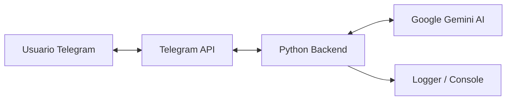

# 🤖 Telegram AI Bot con Gemini 3 Flash

Este es un bot de Telegram inteligente desarrollado en Python que utiliza la API de Google Gemini para responder consultas en tiempo real. Soporta respuestas largas mediante fragmentación automática de mensajes.

## 🚀 Características Principales 
## 📊 Arquitectura del Sistema



- **IA de última generación:** Integración con Gemini 3 Flash.
- **Memoria de Contexto:** Utiliza model.start_chat para recordar interacciones previas dentro de una misma sesión.
- **Procesamiento Asíncrono:** Construido sobre python-telegram-bot para gestionar múltiples usuarios simultáneamente sin bloqueos.
- **UX Optimizada:** Implementa acciones de chat en tiempo real (typing...) mientras la IA genera la respuesta.
- **Fragmentación Inteligente:** Sistema automático de segmentación para respuestas que superan el límite de 4096 caracteres de Telegram.
- **Seguridad Industrial:** Gestión de credenciales mediante variables de entorno (python-dotenv) y exclusión de archivos sensibles en Git.

## 🛠️ Instalación y Configuración

Sigue estos pasos para tener tu propio bot funcionando:

### 1. Clonar el repositorio
```bash
git clone [https://github.com/tu-usuario/tu-repositorio.git](https://github.com/tu-usuario/tu-repositorio.git)
cd tu-repositorio
```
### 2. Crear un entorno virtual
python -m venv venv
# Activar en Windows:
.\venv\Scripts\activate
# Activar en Mac/Linux:
source venv/bin/activate

### 3. Instalar dependencias
pip install -r requirements.txt

### 4. Configurar credenciales
Crea un archivo .env en la carpeta raíz y añade tus llaves:

TELEGRAM_TOKEN=TU_TOKEN_DE_BOTFATHER
GEMINI_API_KEY=TU_API_KEY_DE_GOOGLE_STUDIO

### 5. Ejecutar el bot
python bot.py

## 📦 Stack Tecnológico

| Tecnología            | Uso                                                              |
| :-------------------- | :--------------------------------------------------------------- |
| Python 3.14+          | Lenguaje núcleo del backend.                                     |
| Google Generative AI  | Motor de inteligencia artificial (Gemini 3 Flash).               |
| Python-Telegram-Bot   | Framework para la interfaz de mensajería asíncrona.              |
| Python-Dotenv         | Gestión segura de configuraciones y secretos.                    |

| Logging               | Monitoreo y trazabilidad de eventos en tiempo real.              |

## 👨‍💻 Desarrollado por
Ronald Mora - Ingeniero de Sistemas.